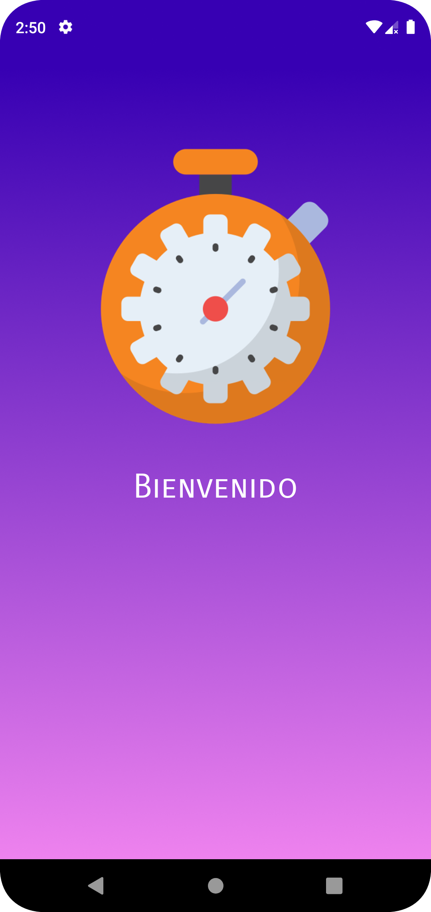
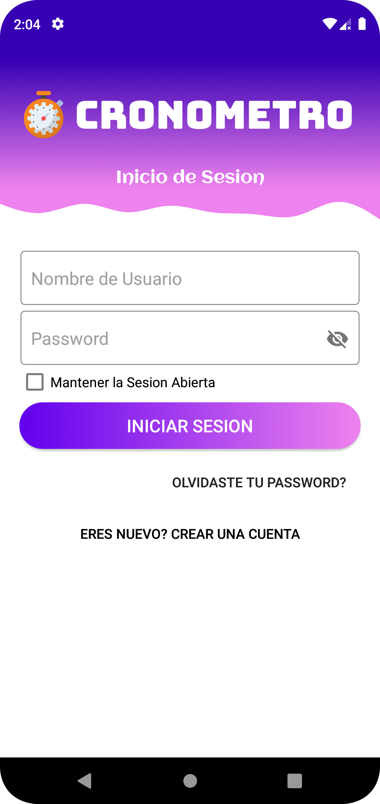
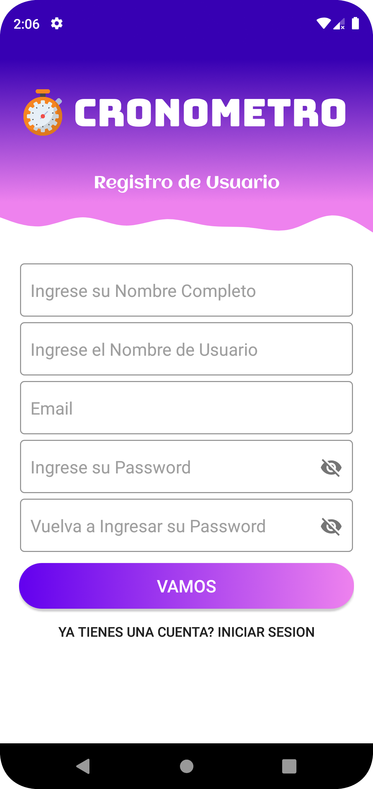
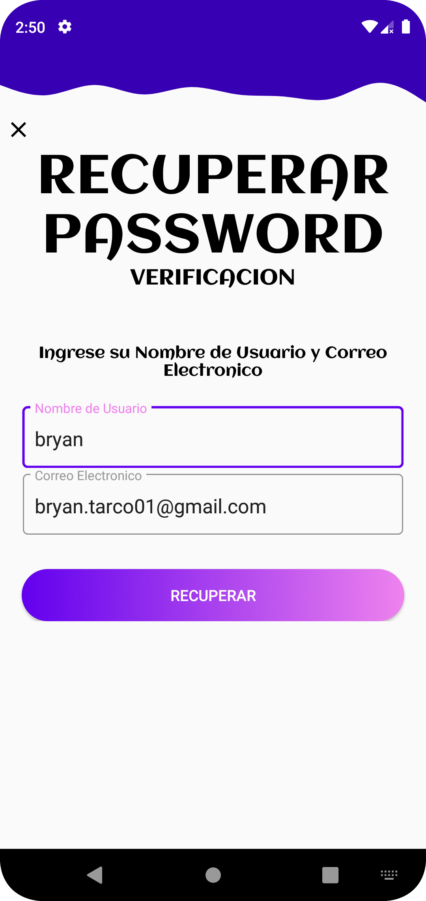
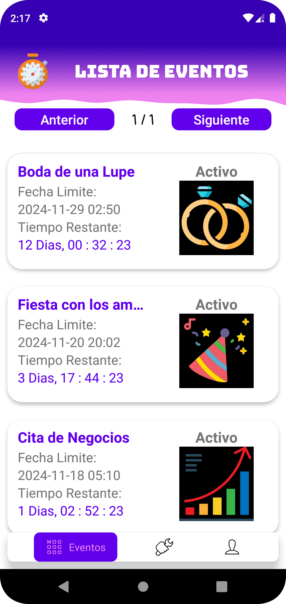
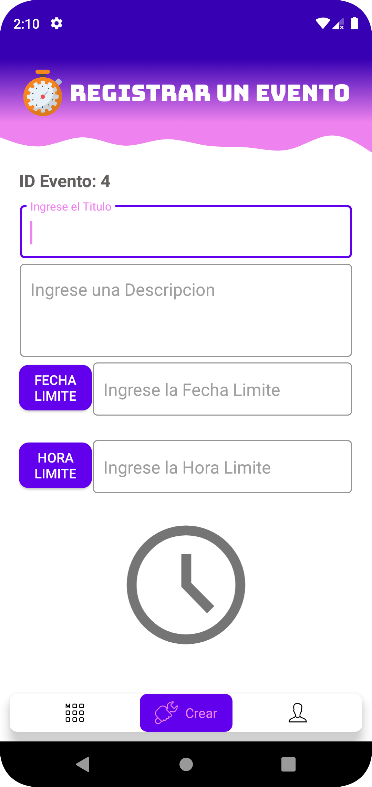
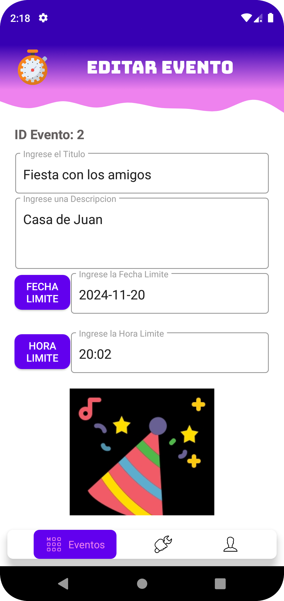
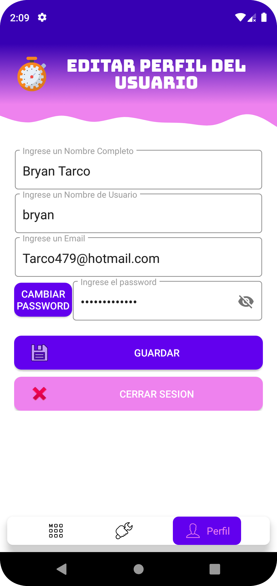

  
  # Cronometro de Eventos App Móvil

  
  
  

## Indice

- [Cronometro de Eventos App Móvil](#cronometro-de-eventos-app-móvil)
  - [Descripción](#descripción)
    - [Tecnologías](#tecnologías)
  - [Dominio](#dominio)
    - [Evento](#evento)
    - [Usuario](#usuario)
  - [Funciones](#funciones)
    - [Probar la Aplicación](#probar-la-aplicación)
  - [Autor](#autor)
    - [Contacto](#contacto)
  - [Licencia de Uso](#licencia-de-uso)

## Descripción
Este proyecto es una Aplicación Móvil para establecer y visualizar el tiempo limite hasta que se cumpla un evento. Creada en Android Studio, utilizando el lenguage Java.
Las funciones principales:
- Inicio de sesión, mantiene activa la sesión.
- Creación de una cuenta de Usuario.
- CREATE, LIST, UPDATE, DELETE eventos.
- Uso de fragmentos para agilizar el desplazamiento entre pantallas.
- Almacenamiento de images.
- Visualización del tiempo limite en tiempo real.
- Utilización de CardView y RecyclerView.
   
### Tecnologías

- Lenguaje de Programación: [Java](https://www.java.com/es/) - Lenguaje predeterminado de Android Studio.
- Base de Datos: [SQLite3](https://developer.android.com/tools/sqlite3?hl=es-419) - Administrar la base de datos de la aplicación.
- Material Design: EditText - Android.material:1.0.0
- Menú Principal: [Chip Navigation](https://github.com/ismaeldivita/chip-navigation-bar) - Menú Flotante para cambiar entre fragmentos.
- Lista de Eventos: RecyclerView:1.1.0 y CardView:1.0.0
- Calcular el tiempo restante: [threetenbp](https://github.com/JakeWharton/ThreeTenABP) : 1.3.0
- Diseño de PIN de acceso: [pinview](https://github.com/ChaosLeung/PinView) : 1.4.3 - crear interfaz para insersar clave de acceso mediante el uso de un PIN.
  
## Dominio

Gestionar usuarios, y eventos, sabemos que:

- Un evento es registrado por un usuario, tiene su descripcion, fecha y hora limite, y una imagen que lo represente.
- Un usuario puede crearse una cuenta para acceder al sistema, iniciar sesión, editar su perfil, cambiar y recuperar su contraseña..

### Evento

| Campo       | Tipo    | Descripción            |
|-------------|---------|------------------------|
| id          | UUID    | Identificar único      |
| titulo      | text    | Título del Evento      |
| descripcion | text    | Descripción del Evento |
| f_final     | text    | Fecha Final del Evento |
| hora_final  | text    | Hora Final del evento  |
| imagen      | blob    | Imagen del Evento      |
| estado      | text    | Estado del Evento      |
| fk_usuario  | Usuario | Usuario del Evento     |

### Usuario

| Campo     | Tipo | Descripción              |
|-----------|------|--------------------------|
| id        | UUID | Identificador único      |
| nombre    | text | Nombre del Usuario       |
| user_name | text | Nombre único del Usuario |
| email     | text | Email del Usuario        |
| password  | text | Contraseña del Usuario   |

## Funciones
<table>
  <tr>
    <td witdh="50%">
      <h3 align="center">Splash Screen</h3>
      

        
        

          - Primera pantalla de la aplicación, animación de cierre entre el icono de la aplicación y el nombre de la misma.
        

      

    </td>
    <td witdh="50%">
      <h3 align="center">Inicio de Sesión</h3>
      

        
        

          - Pantalla de Inicio de Sesión, solo pueden ingresar usuarios que esten registrados en la base de datos. 
          - Opción de mantener activa la sesión, incluso si se cierra la aplicación.
        

      

    </td>
  </tr>
  
  <tr>
    <td witdh="50%">
      <h3 align="center">Crear un Usuario</h3>
      

        
        

          - Crear una cuenta de usuario para acceder a la aplicación. Campo de confirmación de contraseña.
        

      

    </td>
    <td witdh="50%">
      <h3 align="center">Resetear Constraseña</h3>
      

        
        

          - Resetear la contraseña utilizando el username y el email.
        

      

    </td>    
  </tr>

  
  <tr>
  <td witdh="50%">
      <h3 align="center">Lista de Eventos</h3>
      

        
        

          - Lista de Eventos Creados, paginados para una mejor organización. 
          - Menu Flotante con las opciones: 1. Lista de Eventos, 2. Crear Evento Nuevo, 3. Perfil del Usuario.
        

      

    </td>   
    <td witdh="50%">
      <h3 align="center">Crear Nuevo Evento</h3>
      

        
        

          - Crear un nuevo evento, nombre, descripción, fecha y hora limites.  
          - La imagen del evento se puede seleccionar de la galería del dispositivo.
        

      

    </td>
    
  </tr>

  <tr>
  <td witdh="50%">
      <h3 align="center">Editar o Eliminar un Evento</h3>
      

        
        

          - Actualizar o Eliminar un Evento.         
        

      

    </td>
    <td witdh="50%">
      <h3 align="center">Perfil del Usuario</h3>
      

        
        

          - Ver o Actualizar Usuario de la sesión actual.    
          - Se utiliza un cuadro de dialogo para actualizar la contraseña.
        

      

    </td>
  
  </tr>
</table>

### Probar la Aplicación

[Descargar la aplicación](https://github.com/bnphony/Cronometro-AS/tree/master/img_app/CronometroApp.apk)

## Autor
Codificado por [Bryan Jhoel Tarco Taipe](https://github.com/bnphony)

### Contacto

## Licencia de Uso
Este repositorio y todo su contenido está licenciado bajo licencia **Creative Commons**. Por favor si compartes, usas o modificas este proyecto cita a su
autor, y usa las mismas condiciones para su uso docente, formativo o educativo y no comercial.
